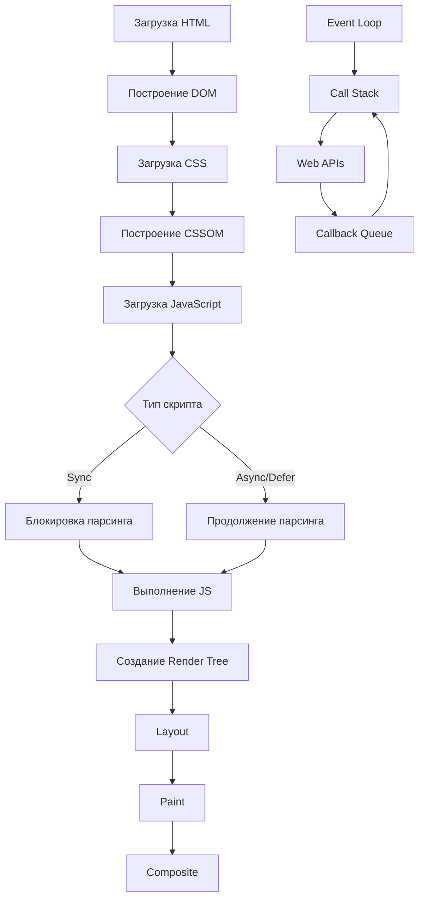
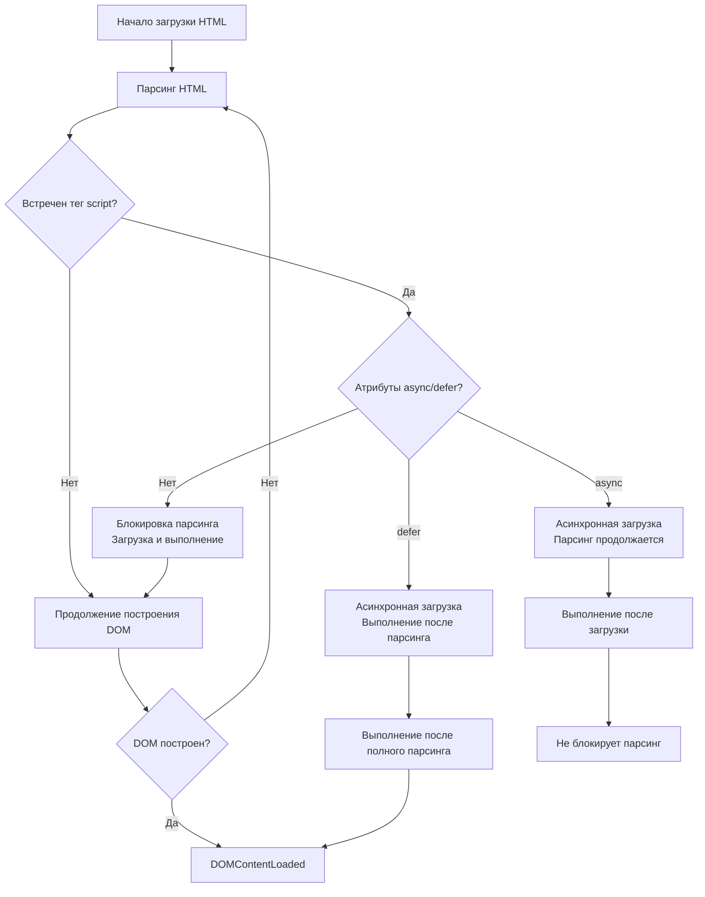
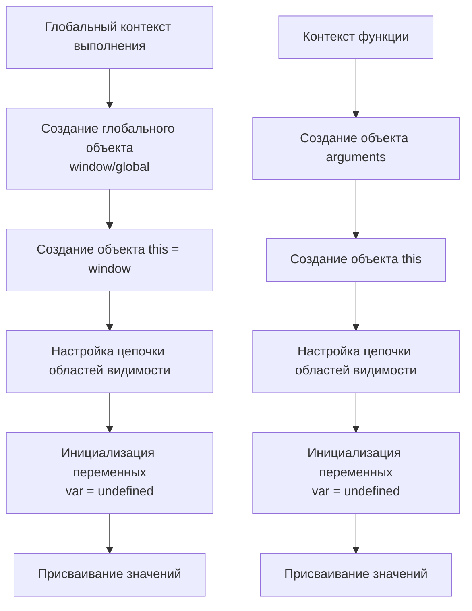
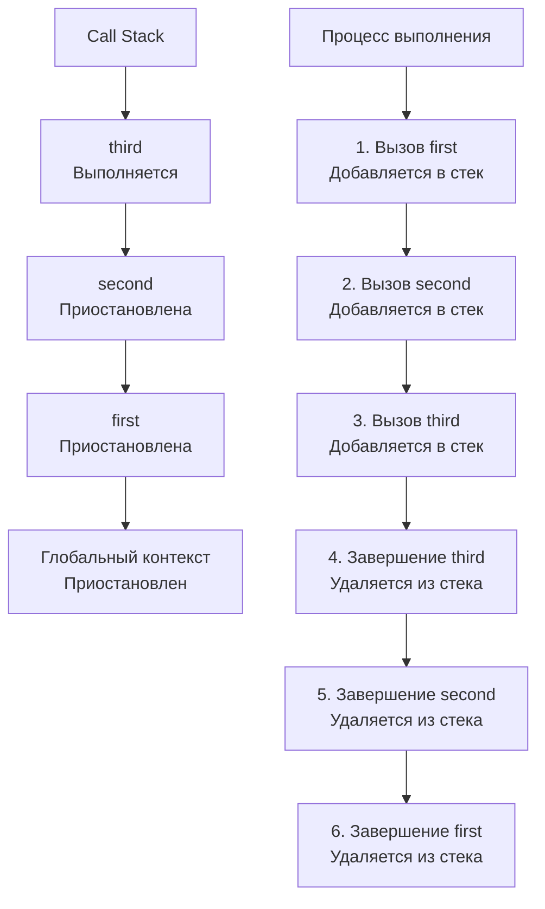
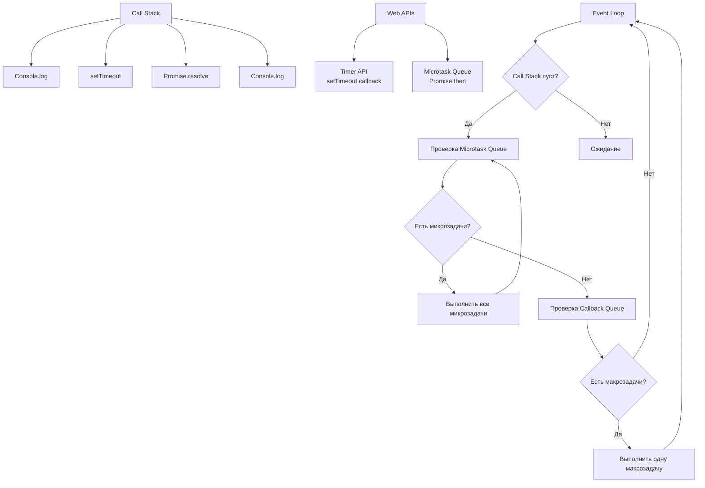
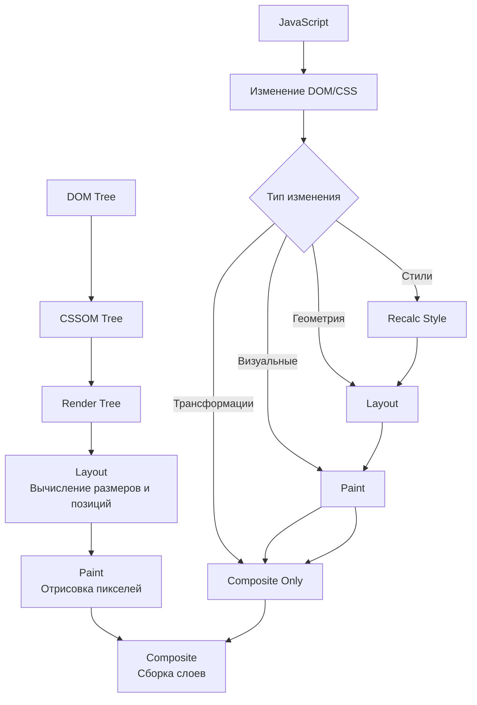
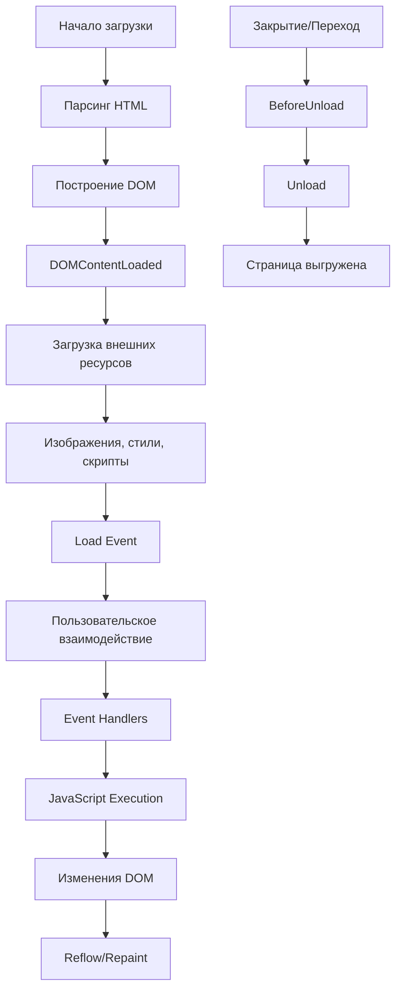

# Выполнение JavaScript кода в контексте DOM: подробное объяснение со схемами

## Обзор процесса выполнения JavaScript в браузере



## Детальный процесс выполнения

### 1. Фаза загрузки и парсинга

```javascript
// Пример HTML структуры
/*
<!DOCTYPE html>
<html>
<head>
    <script src="script1.js"></script> <!-- Синхронный скрипт -->
    <script async src="script2.js"></script> <!-- Асинхронный скрипт -->
    <script defer src="script3.js"></script> <!-- Отложенный скрипт -->
</head>
<body>
    <div id="content">Hello World</div>
    <script>
        // Встроенный скрипт
        console.log('Inline script executed');
    </script>
</body>
</html>
*/
```



### 2. Контекст выполнения (Execution Context)

```javascript
// Глобальный контекст выполнения
const globalVariable = "I'm global";

function outerFunction() {
    // Контекст выполнения outerFunction
    const outerVar = "I'm in outer function";
    
    function innerFunction() {
        // Контекст выполнения innerFunction
        const innerVar = "I'm in inner function";
        console.log(globalVariable); // Доступ к глобальной переменной
        console.log(outerVar); // Доступ к переменной внешней функции
    }
    
    innerFunction();
}

outerFunction();
```



### 3. Стек вызовов (Call Stack)

```javascript
function first() {
    console.log('First function start');
    second();
    console.log('First function end');
}

function second() {
    console.log('Second function start');
    third();
    console.log('Second function end');
}

function third() {
    console.log('Third function start');
    console.log('Third function end');
}

first();
```



### 4. Event Loop и асинхронные операции

```javascript
console.log('Script start'); // 1

setTimeout(function() {
    console.log('setTimeout'); // 4
}, 0);

Promise.resolve().then(function() {
    console.log('Promise'); // 3
});

console.log('Script end'); // 2
```



## Взаимодействие с DOM

### 5. Render Tree и процесс отрисовки

```javascript
// JavaScript влияет на Render Tree
const element = document.getElementById('myElement');
element.style.color = 'red'; // Изменение стиля
element.innerHTML = 'New content'; // Изменение содержимого

// Это вызывает повторные вычисления
/*
1. Style Recalculation
2. Layout Reflow
3. Paint
4. Composite
*/
```



### 6. Жизненный цикл страницы

```javascript
// События жизненного цикла
document.addEventListener('DOMContentLoaded', function() {
    console.log('DOM построен, но внешние ресурсы могут еще загружаться');
});

window.addEventListener('load', function() {
    console.log('Все ресурсы загружены');
});

window.addEventListener('beforeunload', function(event) {
    console.log('Страница закрывается');
    // Можно показать подтверждение закрытия
    event.preventDefault();
    event.returnValue = '';
});
```



## Практические примеры выполнения

### 7. Пример полного выполнения кода

```javascript
// Глобальный контекст инициализируется первым
var globalVar = "Global variable";
let blockScopedVar = "Block scoped";

function main() {
    // Контекст функции main создается при вызове
    console.log("Main function started");
    
    // Синхронный вызов
    synchronousTask();
    
    // Асинхронные операции
    asynchronousTask();
    
    console.log("Main function ended");
}

function synchronousTask() {
    // Новый контекст в стеке вызовов
    const localVar = "Local variable";
    console.log("Synchronous task:", localVar);
}

function asynchronousTask() {
    console.log("Starting async task");
    
    // Макрозадача
    setTimeout(() => {
        console.log("Timeout completed");
    }, 0);
    
    // Микрозадача
    Promise.resolve().then(() => {
        console.log("Promise resolved");
    });
    
    // Другой тип асинхронной операции
    requestAnimationFrame(() => {
        console.log("Animation frame");
    });
}

// Запуск основной функции
main();
console.log("Global context execution");
```

**Порядок выполнения:**
1. `Main function started`
2. `Synchronous task: Local variable`
3. `Starting async task`
4. `Main function ended`
5. `Global context execution`
6. `Promise resolved` (микрозадача)
7. `Animation frame` (raf callback)
8. `Timeout completed` (макрозадача)

### 8. Взаимодействие с DOM API

```javascript
// Контекст выполнения при работе с DOM
document.addEventListener('DOMContentLoaded', function() {
    // Этот код выполняется когда DOM готов
    
    const container = document.getElementById('container');
    
    // Создание элементов
    function createElements() {
        for (let i = 0; i < 1000; i++) {
            const element = document.createElement('div');
            element.textContent = `Item ${i}`;
            
            // Пакетное добавление для оптимизации
            if (i % 100 === 0) {
                // Принудительная синхронизация для минимизации reflow
                container.appendChild(element);
            } else {
                // DocumentFragment для пакетной вставки
                const fragment = document.createDocumentFragment();
                fragment.appendChild(element);
                container.appendChild(fragment);
            }
        }
    }
    
    // Асинхронная операция с отложенным рендерингом
    function asyncRender() {
        // Использование requestIdleCallback для фоновой работы
        if ('requestIdleCallback' in window) {
            requestIdleCallback(function(deadline) {
                while ((deadline.timeRemaining() > 0 || deadline.didTimeout) && hasWork) {
                    createElements();
                }
            });
        } else {
            // Fallback для старых браузеров
            setTimeout(createElements, 0);
        }
    }
    
    asyncRender();
});
```

## Критические моменты производительности

### 9. Блокирующие операции

```javascript
// ПЛОХО: Долгая синхронная операция блокирует основной поток
function blockingOperation() {
    const start = Date.now();
    while (Date.now() - start < 5000) {
        // Блокирует выполнение на 5 секунд
    }
    console.log("Blocking operation completed");
}

// ХОРОШО: Разбиение на части с помощью setTimeout
function nonBlockingOperation() {
    let processed = 0;
    const total = 1000000;
    
    function processChunk() {
        const chunkSize = 1000;
        for (let i = 0; i < chunkSize; i++) {
            if (processed >= total) {
                console.log("Non-blocking operation completed");
                return;
            }
            // Обработка данных
            processed++;
        }
        
        // Позволяем браузеру обработать другие задачи
        setTimeout(processChunk, 0);
    }
    
    processChunk();
}
```

## Заключение

Понимание контекста выполнения JavaScript в DOM критически важно для:
- **Оптимизации производительности**
- **Правильной работы с асинхронным кодом**
- **Эффективного управления памятью**
- **Создания отзывчивых пользовательских интерфейсов**

Ключевые концепции:
1. **Стек вызовов** - для синхронных операций
2. **Event Loop** - для асинхронных операций
3. **Render Pipeline** - для взаимодействия с DOM
4. **Memory Management** - для избежания утечек памяти

Этот комплексный подход позволяет писать эффективный JavaScript код, который хорошо взаимодействует с браузерным окружением.