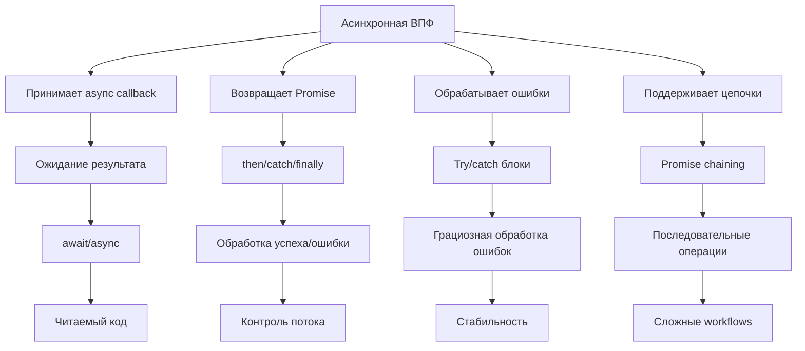
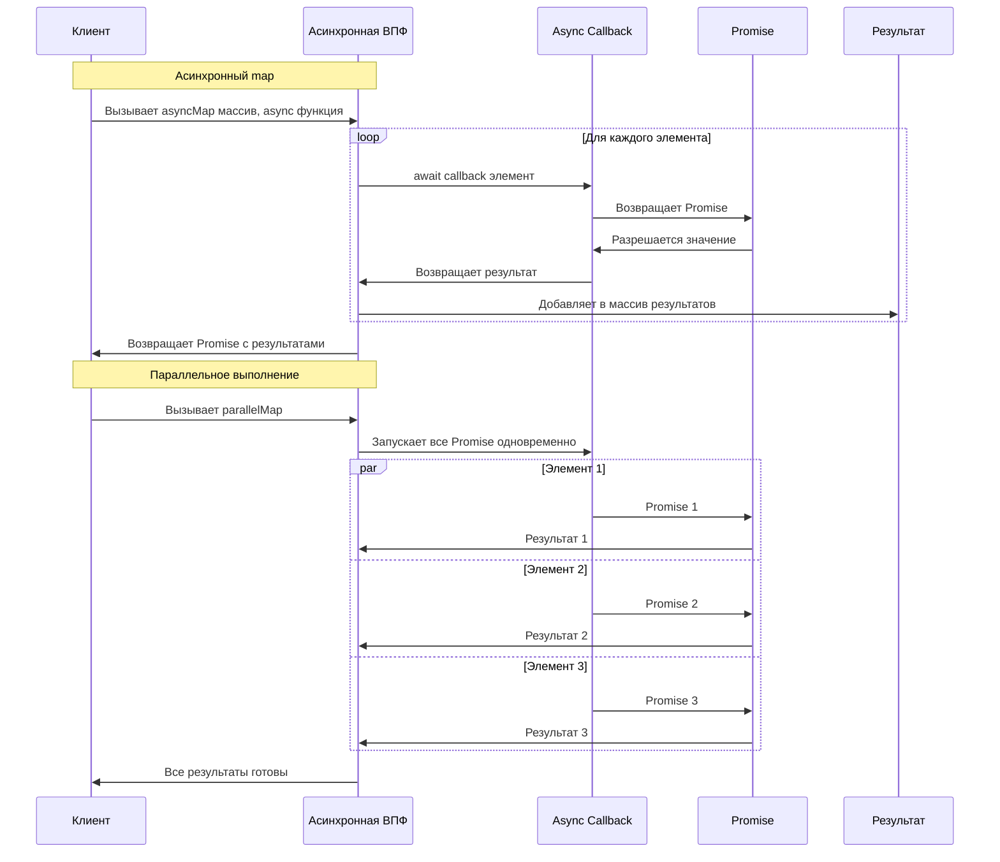
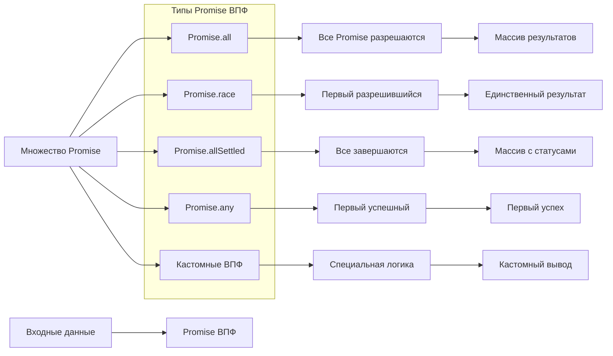
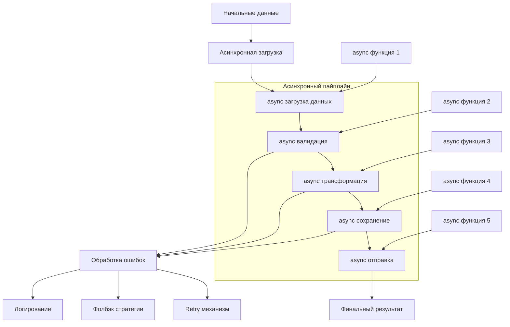
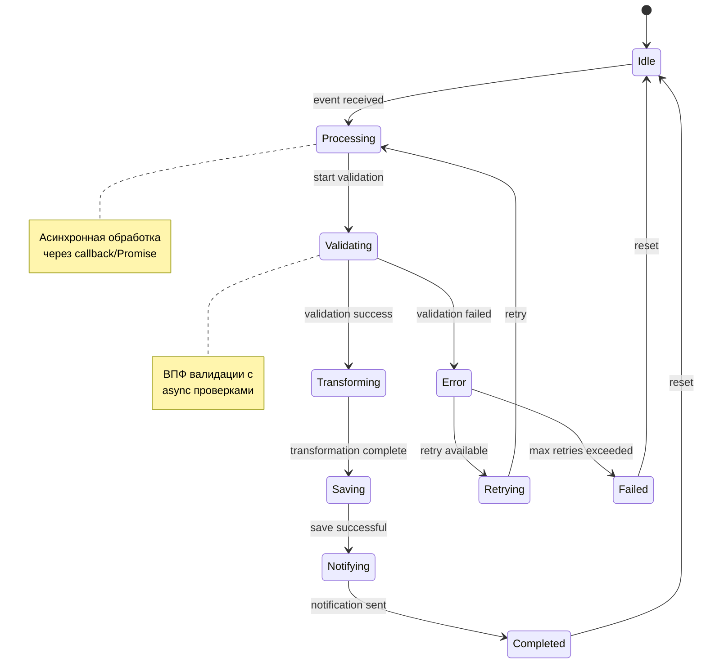
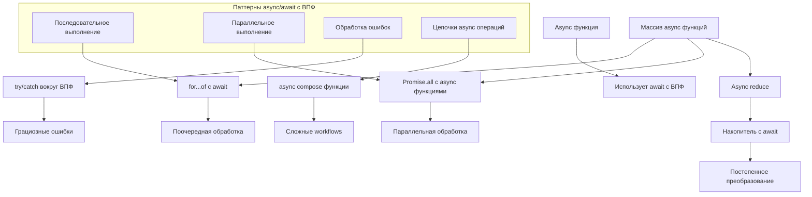
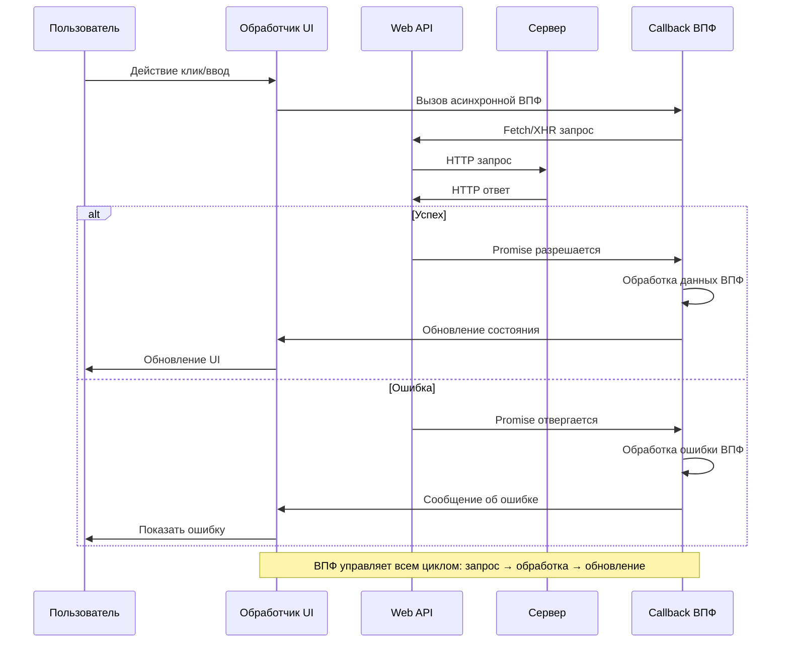
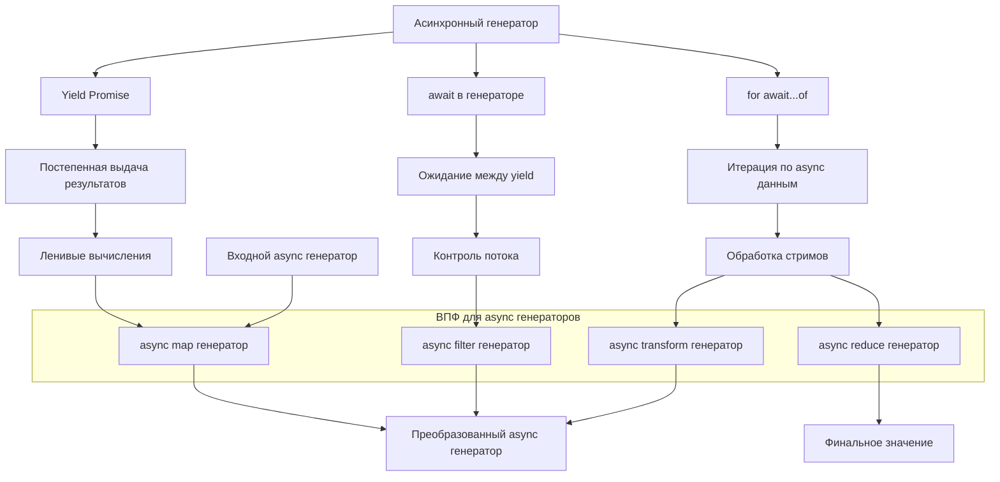
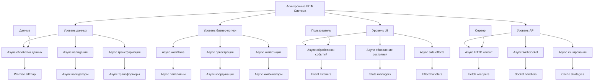
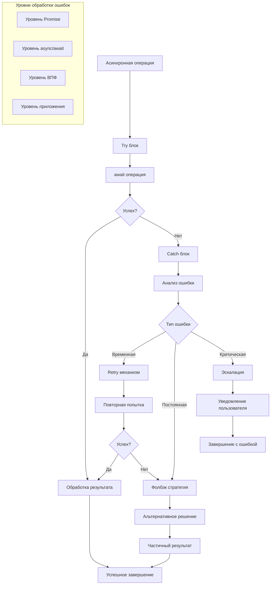

# Асинхронные взаимодействия функций высшего порядка

## 1. Общая схема асинхронных ВПФ



## 2. Асинхронные аналоги Array методов



## 3. Promise-based функции высшего порядка



## 4. Асинхронная обработка с retry механизмом

```mermaid
sequenceDiagram
    participant U as Пользователь
    participant R withRetry
    participant A as Async функция
    participant D as Данные

    U->>R: Вызов с функцией и параметрами
    Note over R: Настройка: макс 3 попытки, задержка 1с
    
    loop Попытки (1..3)
        R->>A: Вызов async функции
        A->>D: Запрос данных
        D->>A: Ответ/Ошибка
        A->>R: Результат/Исключение
        
        alt Успех
            R->>U: Возвращает результат
            break
        else Ошибка
            Note over R: Попытка {n} неудачна
            R->>R: Ожидание перед повторной попыткой
        end
    end
    
    alt Все попытки исчерпаны
        R->>U: Исключение "Все попытки failed"
    end
```

## 5. Асинхронный пайплайн обработки данных



## 6. Event-driven асинхронные ВПФ



## 7. Async/await с функциями высшего порядка



## 8. Web API и асинхронные ВПФ



## 9. Асинхронные генераторы и ВПФ



## 10. Полная система асинхронных ВПФ



## 11. Обработка ошибок в асинхронных ВПФ



## Ключевые принципы асинхронных ВПФ:

1. **Неблокирующие операции** - использование Promise/async/await
2. **Обработка ошибок** - комплексные стратегии retry/fallback
3. **Параллельное выполнение** - Promise.all, Promise.race
4. **Последовательные цепочки** - async композиция и пайплайны
5. **Реактивность** - обработка событий и потоков данных
6. **Ресурсоэффективность** - lazy evaluation, отмена операций

Асинхронные ВПФ позволяют создавать отзывчивые и эффективные приложения, управляя сложными потоками данных и операций.