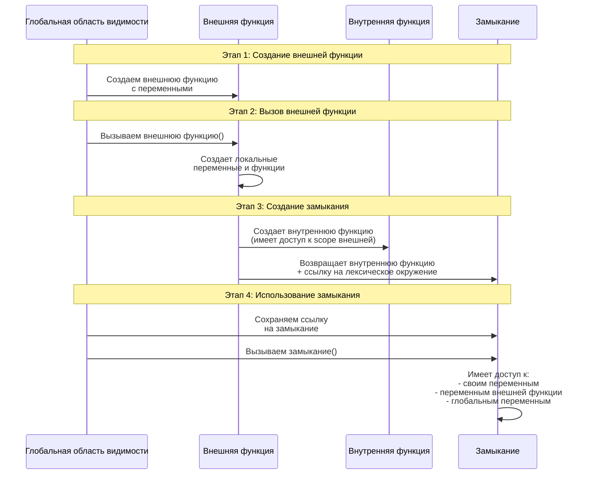
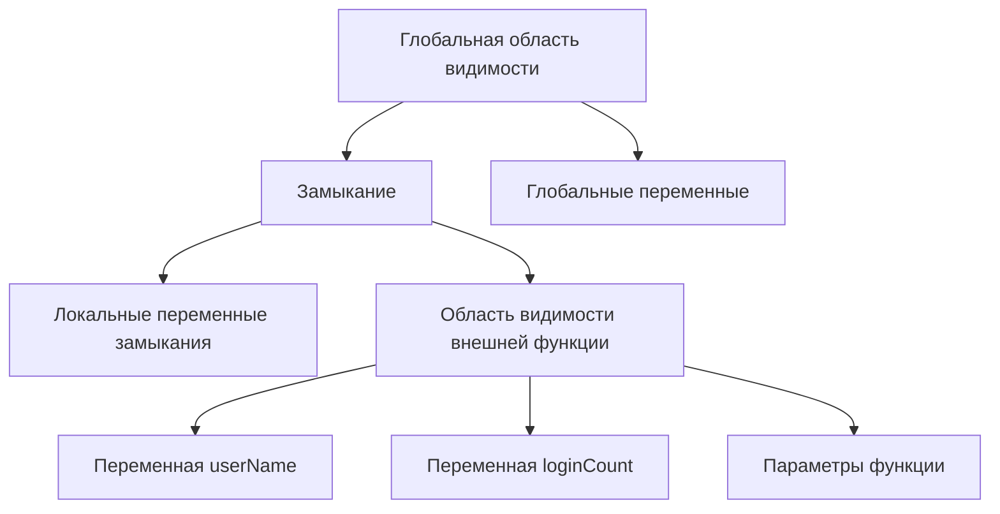

# Замыкания в JavaScript: Подробное объяснение с диаграммами

## 📊 Диаграмма последовательностей создания замыкания



## 🔍 Что такое замыкание?

**Замыкание** - это функция, которая запоминает свое лексическое окружение даже после того, как внешняя функция завершила выполнение.

## 🏗️ Процесс создания замыкания

### Этап 1: Базовый пример

```javascript
function createCounter() {
    // Лексическое окружение внешней функции
    let count = 0; // Эта переменная будет "запомнена"
    
    // Внутренняя функция - ЗАМЫКАНИЕ
    return function() {
        count++; // Имеет доступ к переменной count из внешней функции
        return count;
    };
}

// Создаем замыкание
const counter = createCounter();

// Диаграмма состояния памяти:
/*
Лексическое окружение counter:
{
    count: 0 (из createCounter),
    [[Environment]]: ссылка на окружение createCounter
}
*/
```

### Этап 2: Детальный разбор с комментариями

```javascript
// 1. Объявление внешней функции
function createUser(name) {
    // Локальная переменная внешней функции
    let userName = name;
    let loginCount = 0;
    
    console.log(`Создан пользователь: ${userName}`);
    
    // 2. Объявление внутренней функции (будущее замыкание)
    function login() {
        loginCount++; // Доступ к переменной внешней функции
        const message = `Добро пожаловать, ${userName}!`; // Доступ к другой переменной
        console.log(message);
        return `Вы заходили ${loginCount} раз(а)`;
    }
    
    function updateName(newName) {
        const oldName = userName; // Запоминаем старое имя
        userName = newName; // Меняем переменную внешней функции
        return `Имя изменено: ${oldName} -> ${userName}`;
    }
    
    // 3. Возвращаем объект с методами (замыканиями)
    return {
        login: login,
        updateName: updateName,
        getInfo: function() {
            return `Пользователь: ${userName}, логинов: ${loginCount}`;
        }
    };
}

// 4. Внешняя функция завершилась, но...
const user = createUser("Иван");
/*
В этот момент:
- createUser завершила выполнение
- Но внутренние функции сохранили доступ к:
  - userName = "Иван"
  - loginCount = 0
*/

// 5. Используем замыкания
console.log(user.login()); // "Добро пожаловать, Иван!", "Вы заходили 1 раз(а)"
console.log(user.login()); // "Добро пожаловать, Иван!", "Вы заходили 2 раз(а)"
console.log(user.updateName("Петр")); // "Имя изменено: Иван -> Петр"
console.log(user.getInfo()); // "Пользователь: Петр, логинов: 2"
```

## 📈 Диаграмма области видимости замыкания



## 🎯 Практические примеры замыканий

### Пример 1: Приватные переменные

```javascript
function createBankAccount(initialBalance) {
    // Приватные переменные - недоступны извне
    let balance = initialBalance;
    let transactionHistory = [];
    
    // Публичные методы - имеют доступ к приватным переменным
    return {
        deposit: function(amount) {
            balance += amount;
            transactionHistory.push(`+${amount}`);
            return `Внесено: ${amount}. Баланс: ${balance}`;
        },
        
        withdraw: function(amount) {
            if (amount <= balance) {
                balance -= amount;
                transactionHistory.push(`-${amount}`);
                return `Снято: ${amount}. Баланс: ${balance}`;
            }
            return "Недостаточно средств";
        },
        
        getBalance: function() {
            return balance; // Прямой доступ к приватной переменной
        },
        
        getHistory: function() {
            return [...transactionHistory]; // Возвращаем копию
        }
    };
}

const account = createBankAccount(1000);
console.log(account.getBalance()); // 1000
console.log(account.deposit(500)); // "Внесено: 500. Баланс: 1500"
console.log(account.withdraw(200)); // "Снято: 200. Баланс: 1300"

// Прямой доступ к balance невозможен - она приватная
console.log(account.balance); // undefined
```

### Пример 2: Фабрика функций

```javascript
function createMultiplier(multiplier) {
    // multiplier "запоминается" в замыкании
    return function(number) {
        return number * multiplier;
    };
}

// Создаем специализированные функции
const double = createMultiplier(2);
const triple = createMultiplier(3);
const timesTen = createMultiplier(10);

console.log(double(5)); // 10 (5 * 2)
console.log(triple(5)); // 15 (5 * 3)
console.log(timesTen(5)); // 50 (5 * 10)

// Каждая функция помнит свой multiplier
```

### Пример 3: Управление состоянием

```javascript
function createToggle(initialState = false) {
    let state = initialState;
    
    return {
        toggle: function() {
            state = !state;
            return state;
        },
        
        getState: function() {
            return state;
        },
        
        setState: function(newState) {
            state = newState;
            return state;
        }
    };
}

const switch1 = createToggle(true);
const switch2 = createToggle();

console.log(switch1.getState()); // true
console.log(switch1.toggle()); // false
console.log(switch1.toggle()); // true

console.log(switch2.getState()); // false
console.log(switch2.setState(true)); // true

// Каждый экземпляр имеет свое собственное состояние
```

## 🔄 Замыкания в циклах - распространенная ошибка

### Неправильный подход:

```javascript
function createFunctions() {
    var functions = [];
    
    for (var i = 0; i < 3; i++) {
        functions.push(function() {
            console.log(i); // Всегда выведет 3!
        });
    }
    
    return functions;
}

const funcs = createFunctions();
funcs[0](); // 3 (ожидали 0)
funcs[1](); // 3 (ожидали 1)
funcs[2](); // 3 (ожидали 2)
```

### Правильное решение:

```javascript
function createFunctions() {
    var functions = [];
    
    for (var i = 0; i < 3; i++) {
        // Создаем новую область видимости для каждой итерации
        (function(j) {
            functions.push(function() {
                console.log(j); // Теперь выводит правильные значения
            });
        })(i); // Немедленно вызываем с текущим значением i
    }
    
    return functions;
}

// Или с использованием let (блоковая область видимости)
function createFunctionsModern() {
    const functions = [];
    
    for (let i = 0; i < 3; i++) {
        functions.push(function() {
            console.log(i); // Работает правильно с let
        });
    }
    
    return functions;
}
```

## 💡 Преимущества замыканий

1. **Инкапсуляция** - скрытие реализации
2. **Сохранение состояния** между вызовами
3. **Создание фабрик функций**
4. **Реализация паттернов проектирования**

## ⚠️ Особенности и предосторожности

```javascript
// Потенциальная утечка памяти
function createHeavyObject() {
    const largeData = new Array(1000000).fill("data");
    
    return function() {
        // largeData остается в памяти, даже если мы ее не используем!
        return "Some operation";
    };
}

// Решение - освобождать ненужные ссылки
function createOptimizedObject() {
    let largeData = new Array(1000000).fill("data");
    
    const usefulFunction = function() {
        return "Some operation";
    };
    
    // Освобождаем тяжелые данные, когда они не нужны
    usefulFunction.cleanup = function() {
        largeData = null;
    };
    
    return usefulFunction;
}
```

## 🎓 Итог

Замыкания - это мощный механизм JavaScript, который позволяет функциям "запоминать" свое лексическое окружение. Они активно используются для:

- Создания приватных переменных
- Реализации карринга и частичного применения
- Создания функций с сохранением состояния
- Реализации различных паттернов проектирования

Понимание замыканий необходимо для написания качественного и эффективного JavaScript-кода.