# Исправленные и дополненные диаграммы функций высшего порядка

## 1. Исправленная диаграмма общей концепции

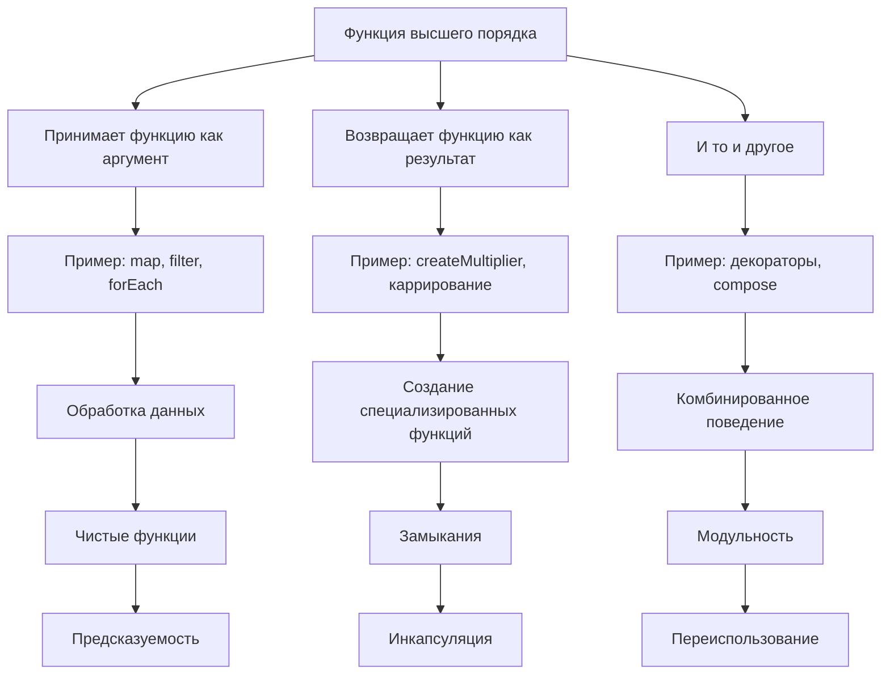

## 2. Общая схема обмена функциями

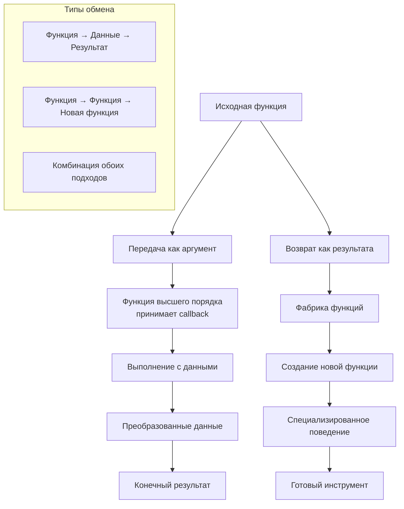

## 3. Детальная схема работы обмена функциями

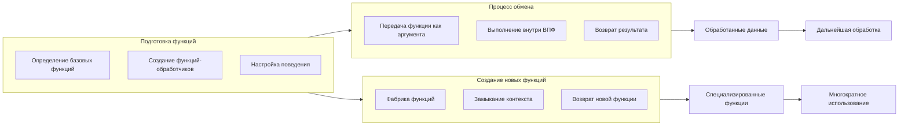

## 4. Полный цикл обмена с примерами

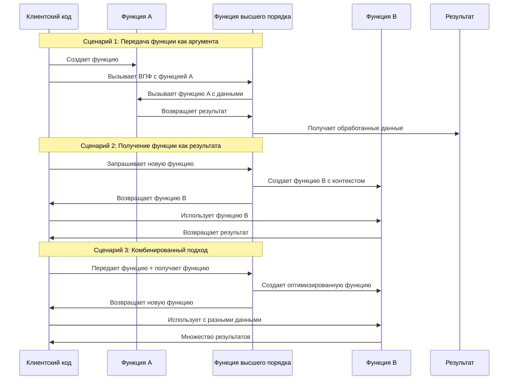

## 5. Исправленная диаграмма работы map

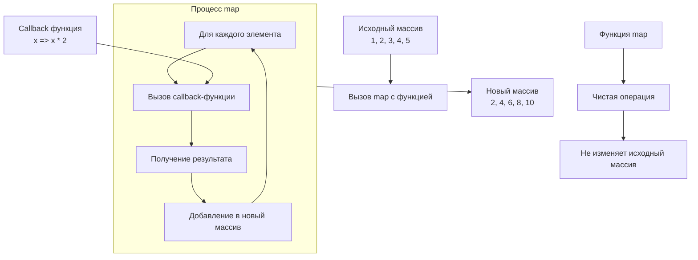

## 6. Типы обмена функциями в JavaScript

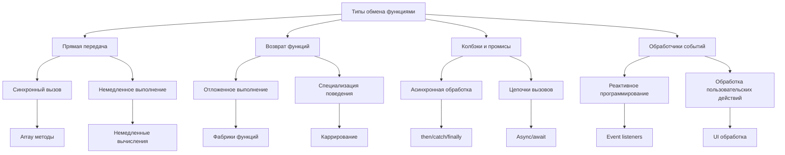

## 7. Процесс создания и использования функций высшего порядка

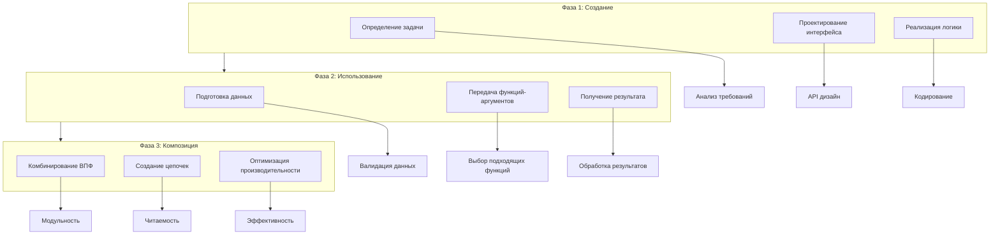

## 8. Поток данных через функции высшего порядка

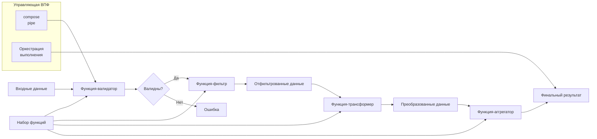

## 9. Взаимодействие между функциями разных уровней

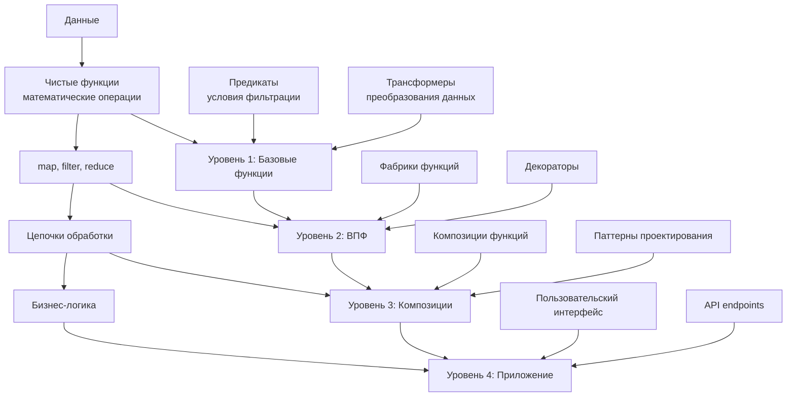
```mermaid
flowchart TD
    A[Async функция] --> B[Использует await с ВПФ]
    
    subgraph C [Паттерны async/await с ВПФ]
        D[Последовательное выполнение]
        E[Параллельное выполнение]
        F[Обработка ошибок]
        G[Цепочки async операций]
        Z[Итерации с async]
    end
    
    %% Последовательное выполнение
    D --> H[for...of с await]
    D --> AA[for цикл с await]
    D --> BB[while с await]
    
    H --> CC[Поочередная обработка элементов]
    AA --> CC
    BB --> DD[Условная последовательность]
    CC --> L[Поочередная обработка]
    DD --> L
    
    %% Параллельное выполнение
    E --> I[Promise.all с async функциями]
    E --> EE[Promise.allSettled]
    E --> FF[Promise.race]
    E --> GG[Promise.any]
    
    I --> M[Параллельная обработка]
    EE --> HH[Все результаты с статусами]
    FF --> II[Первый успешный/ошибка]
    GG --> JJ[Первый успешный]
    M --> KK[Максимальная производительность]
    HH --> LL[Полная информация]
    II --> MM[Таймауты и гонки]
    JJ --> NN[Хотя бы один успех]
    
    %% Обработка ошибок
    F --> J[try/catch вокруг ВПФ]
    F --> OO[Индивидуальная обработка]
    F --> PP[Глобальные обработчики]
    
    J --> N[Грациозные ошибки]
    OO --> QQ[Ошибки на уровне операции]
    PP --> RR[Window error events]
    N --> SS[Контролируемые сбои]
    QQ --> TT[Частичные успехи]
    RR --> UU[Критические ошибки]
    
    %% Цепочки async операций
    G --> K[async compose функции]
    G --> VV[Waterfall pattern]
    G --> WW[Pipeline обработки]
    
    K --> O[Сложные workflows]
    VV --> XX[Последовательные преобразования]
    WW --> YY[Обработка данных по стадиям]
    O --> ZZ[Бизнес-логика]
    
    %% Итерации с async
    Z --> P[Массив async функций]
    Z --> AAA[Async генераторы]
    Z --> BBB[Async итераторы]
    
    P --> H
    P --> I
    P --> Q[Async reduce]
    AAA --> CCC[Ленивые вычисления]
    BBB --> DDD[Потоковая обработка]
    
    Q --> R[Накопитель с await]
    R --> S[Постепенное преобразование]
    CCC --> EEE[Экономия памяти]
    DDD --> FFF[Большие datasets]
    
    %% Связи между блоками
    L --> GGG[Медленно но надежно]
    KK --> HHH[Быстро но рискованно]
    SS --> III[Стабильность приложения]
    ZZ --> JJJ[Сложная бизнес-логика]
    S --> KKK[Накопительные операции]
    
    %% Стили для разных типов операций
    classDef sequential fill:#e1f5fe
    classDef parallel fill:#f3e5f5
    classDef error fill:#ffebee
    classDef chain fill:#e8f5e8
    classDef iteration fill:#fff3e0
    
    class D,H,AA,BB,CC,DD,L,GGG sequential
    class E,I,EE,FF,GG,M,KK,HH,II,JJ,LL,MM,NN,HHH parallel
    class F,J,OO,PP,N,QQ,RR,SS,TT,UU,III error
    class G,K,VV,WW,O,XX,YY,ZZ,JJJ chain
    class Z,P,Q,R,S,AAA,BBB,CCC,DDD,EEE,FFF,KKK iteration

    
```
## 10. Эволюция от простых к сложным конструкциям

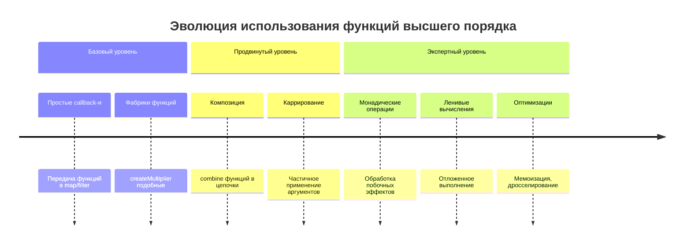

## Как работают обмены функциями в общем:

1. **Функции как данные** - функции передаются и возвращаются как обычные значения
2. **Абстракция поведения** - ВПФ определяют "что" сделать, callback-и - "как"
3. **Композиция** - маленькие функции объединяются в сложное поведение
4. **Специализация** - общие функции настраиваются для конкретных задач
5. **Инкапсуляция** - замыкания сохраняют состояние между вызовами

Ключевой принцип: **Функции высшего порядка работают с поведением так же, как обычные функции работают с данными**.