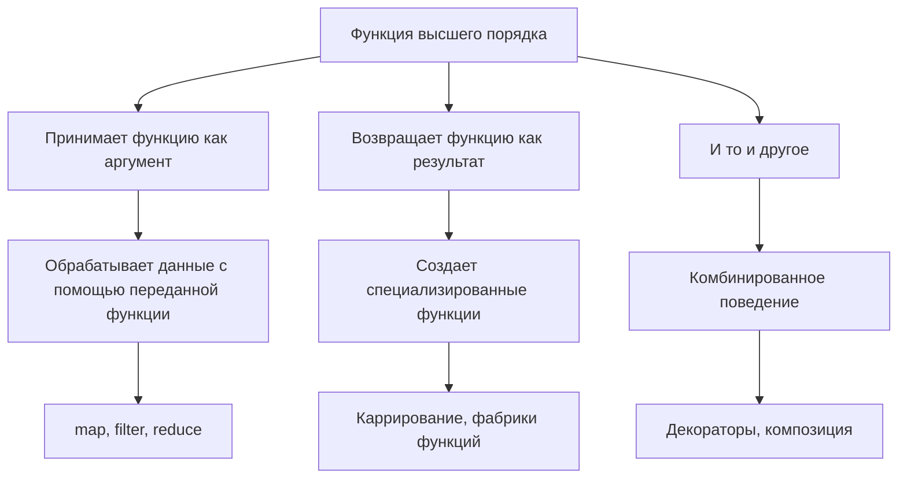
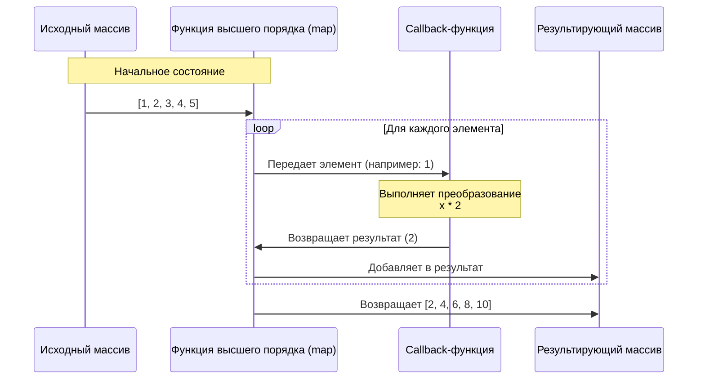
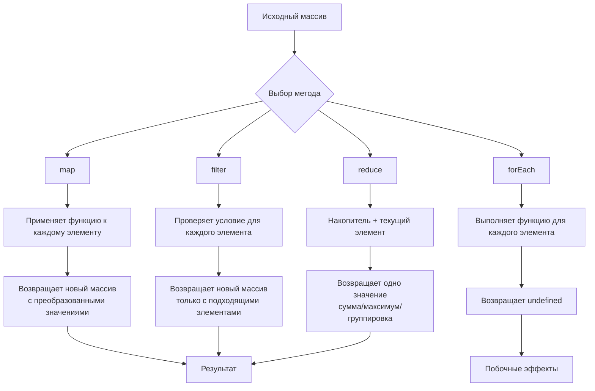
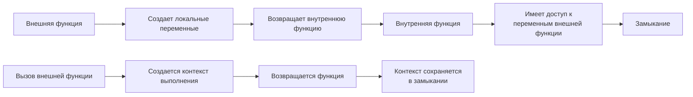
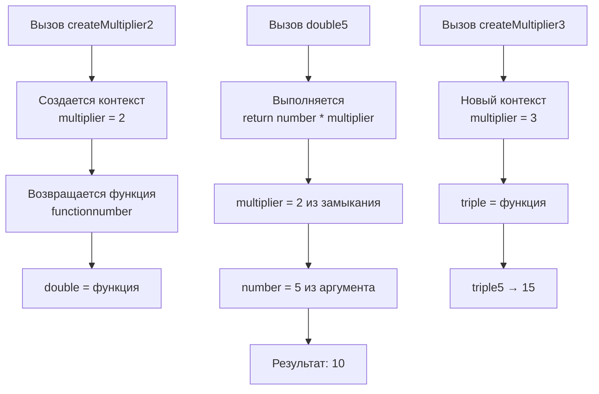
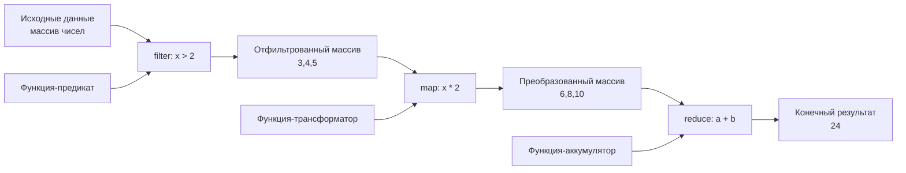
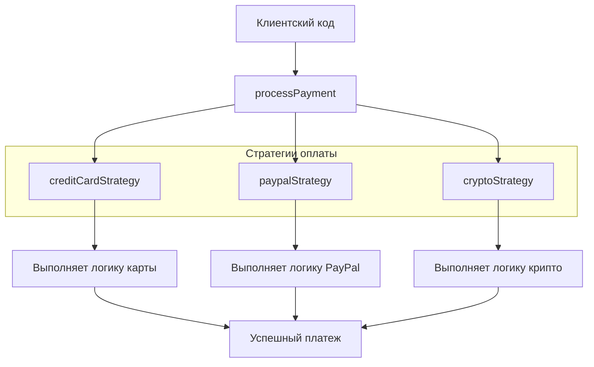
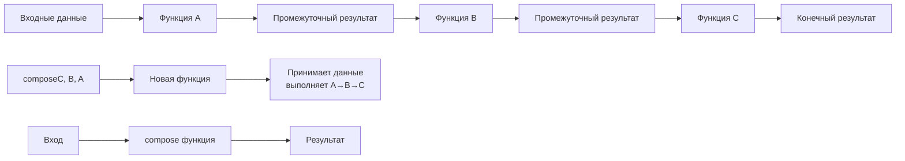
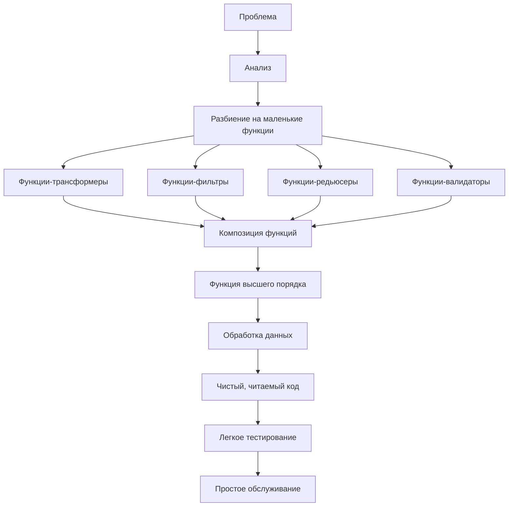

# Диаграммы работы функций высшего порядка

## 1. Общая концепция функций высшего порядка



## 2. Функции, принимающие другие функции (на примере map)



## 3. Процесс работы Array методов



## 4. Функции, возвращающие другие функции (замыкания)



## 5. Практический пример: createMultiplier



## 6. Цепочка функций высшего порядка



## 7. Паттерн Стратегия с функциями высшего порядка



## 8. Процесс композиции функций



## 9. Работа с асинхронными функциями высшего порядка

```mermaid
sequenceDiagram
    participant C as Клиент
    participant HOF as withRetry
    participant F as Асинхронная функция
    participant R as Результат

    C->>HOF: Вызов с функцией и параметрами
    Note over HOF: Попытка 1
    
    loop Максимум 3 попытки
        HOF->>F: Вызов функции
        alt Успех
            F->>HOF: Результат
            HOF->>R: Возвращает результат
            break
        else Ошибка
            F->>HOF: Ошибка
            Note over HOF: Ожидание перед повторной попыткой
        end
    end
    
    alt Все попытки неудачны
        HOF->>C: Исключение
    end
```

## 10. Полный цикл работы функций высшего порядка



Эти диаграммы показывают, как функции высшего порядка:

1. **Абстрагируют** сложную логику
2. **Комбинируют** простые функции в сложное поведение
3. **Создают** специализированные функции из общих
4. **Обрабатывают** данные через цепочки преобразований
5. **Реализуют** паттерны проектирования простым способом

Ключевая идея: функции высшего порядка работают с другими функциями как с данными, что позволяет создавать гибкие и переиспользуемые конструкции.